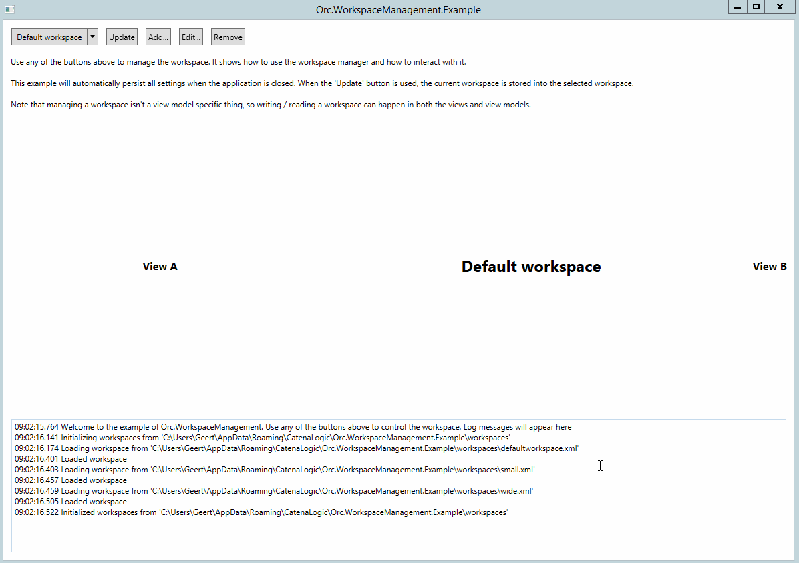

# Orc.WorkspaceManagement

Manage workspaces the easy way using this library.

# Quick introduction

Workspaces are a combination of settings that a user can choose to configure an application. An example is the layout of all docking windows in Visual Studio. The advantage of the workspace management is that it takes away all the plumbing and you can concentrate on the actual usage of workspaces.

The workspace management library makes it easy to manage workspaces. The main component is the *IWorkspaceManager* that contains the current workspace and all available workspaces and allows to load or save workspaces.

Below is an overview of the most important components:

- **IWorkspace** => the actual workspace object
- **IWorkspaceManager** => the workspace manager with events and management methods
- **IWorkspaceInitializer** => allows customization of initial settings of a workspace

  

-- 
 
**Important note** 

The base directory will be used as repository. This means that it cannot contain other files and all other files will be deleted from the directory

-- 

# Creating a workspace initializer

When a workspace manager is created, it doesn't contain anything. The *IWorkspaceInitializer* interface allows the customization of that state. 

By default the following initializers are available:

* **EmptyWorkspaceInitializer** => initializes nothing, this is the default

To create a custom workspace initializer, see the example below:

    public class WorkspaceInitializer : IWorkspaceInitializer
    {
        public Task InitializeAsync(IWorkspace workspace)
        {
            workspace.SetValue("AView.Width", 200d);
            workspace.SetValue("BView.Width", 200d);
            return TaskHelper.Completed;
        }
    }

Next it can be registered in the ServiceLocator (so it will automatically be injected into the *WorkspaceManager*):

	ServiceLocator.Default.RegisterType<IWorkspaceInitializer, MyWorkspaceInitializer>();

**Make sure to register the service before instantiating the *IWorkspaceManager* because it will be injected**

# Initializing the workspace manager

Because the workspace manager is using async, the initialization is a separate method. This gives the developer the option to load the workspaces whenever it is required. To read the stored workspaces from disk, use the code below:

	await workspaceManager.InitializeAsync(); 

# Retrieving a list of all workspaces

    var workspaces = workspaceManager.Workspaces;

# Retrieving the current workspace

The library contains extension methods for the *IWorkspaceManager* to retrieve a typed instance:

	var myWorkspace = workspaceManager.Workspace;

To customize the location where the workspaces are stored, use the *BaseDirectory* property.

# Storing information in a workspace

Storing information in a workspace is the responsibility of every single component in the application. The *IWorkspaceManager* will raise the *WorkspaceInfoRequested* event so every component can put in the required information into the workspace.

To store information in a workspace, set the workspace to be updated as current workspace. Then let the user (or software) customize all components. Call the following method to raise the *WorkspaceInfoRequested* event to update the workspace:

    await workspaceManager.StoreWorkspaceAsync();

**Note that a workspace is only updated, not saved to disk by this method**.

## Providers

Create a provider as shown in the example below:

    public class RibbonWorkspaceProvider : IWorkspaceProvider
    {
        private readonly Ribbon _ribbon;

        public RibbonWorkspaceProvider(Ribbon ribbon)
        {
            Argument.IsNotNull(() => ribbon);

            _ribbon = ribbon;
        }

        public Task ProvideInformationAsync(IWorkspace workspace)
        {
            workspace.SetWorkspaceValue("Ribbon.IsMinimized", _ribbon.IsMinimized);
            return TaskHelper.Completed;
        }

        public Task ApplyWorkspaceAsync(IWorkspace workspace)
        {
            _ribbon.IsMinimized = workspace.GetWorkspaceValue("Ribbon.IsMinimized", false);
            return TaskHelper.Completed;
        }
    }

Then add it to the provider where the ribbon is available:

    public RibbonView()
    {
        InitializeComponent();

        var dependencyResolver = this.GetDependencyResolver();
        var workspaceManager = dependencyResolver.Resolve<IWorkspaceManager>();

        var ribbonWorkspaceProvider = new RibbonWorkspaceProvider(ribbon);
        workspaceManager.AddProvider(ribbonWorkspaceProvider, true);
    }

## Events

Using events is a bit more work, but can accomplish the same:

        public MyComponent(IWorkspaceManager workspaceManager)
        {
            workspaceManager.WorkspaceInfoRequested += OnWorkspaceInfoRequested;
        }

        private void OnWorkspaceInfoRequested(object sender, WorkspaceEventArgs e)
        {
            var workspace = e.Workspace;

            workspace.SetWorkspaceValue("somekey", "somevalue");
        }

**Note that this will only be called when storing the workspace, restoring the workspace needs more events**     

# Saving all workspaces to disk

To save all workspaces to disk, use the code below:

    workspaceManager.Save();

-- 

# Using the XAML behaviors

For the developers using XAML (WPF), behaviors and extension methods are available in the *Orc.WorkspaceManagement.Xaml* library.

## Using the extension methods

Using the extension methods still requires manual work by subscribing to events of both the view and workspace manager, but allow more control.

## Using the behaviors

The behavior is a wrapper around the extension methods and take away to need to manage anything. The behavior is aware of all the events and will handle everything accordingly. To use the behavior, use the code below:

    <views:BView Grid.Row="2" Grid.Column="4">
        <i:Interaction.Behaviors>
            <behaviors:AutoWorkspace />
        </i:Interaction.Behaviors>
    </views:BView>
